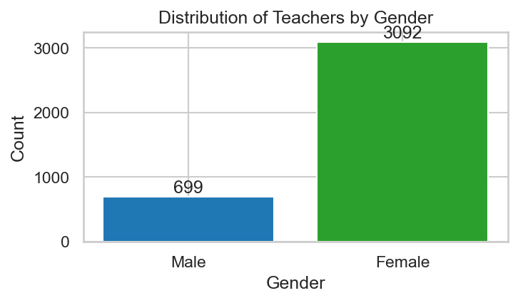
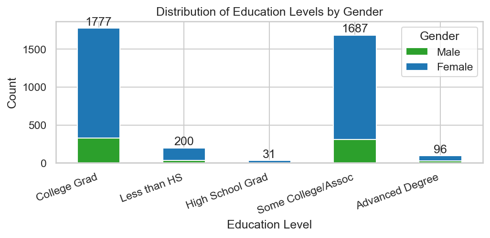
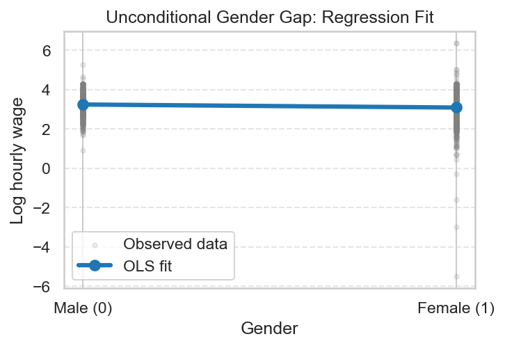
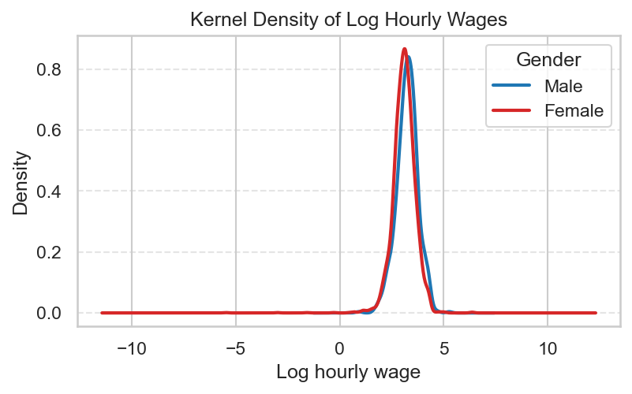
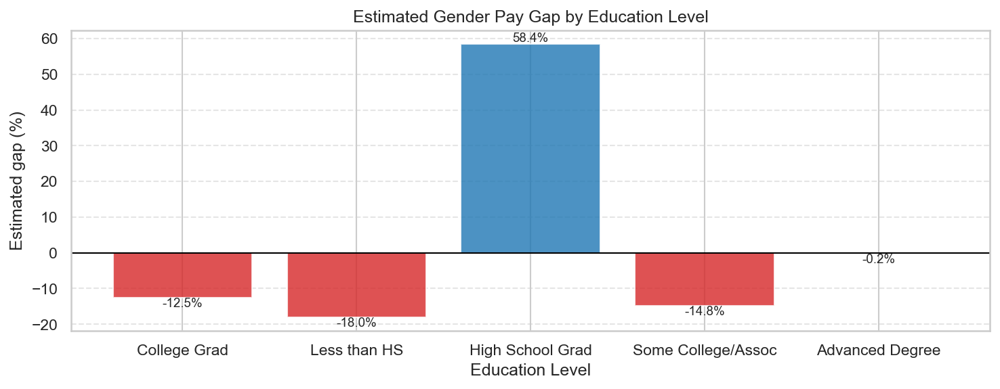
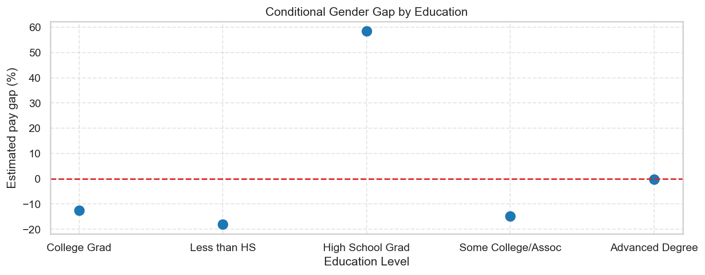

# Gender Pay Gap Among Elementary and Middle School Teachers
**Course:** ECBS5142 - Data Analysis 2  
**Author:** Zariza Chowdhury  
**Dataset:** CPS Earnings, MORG 2014 (N = 3,791 after filtering)  
**Occupation:** Elementary and Middle School Teachers (CPS Code: 2310)  
**Source:** https://osf.io/g8p9j/

---

## Overview

This project estimates the gender pay gap among Elementary and Middle School Teachers using the CPS MORG 2014 dataset. I use OLS regression with robust standard errors (HC3) to estimate both an unconditional gap and a conditional gap that accounts for education level.

---

## Key Decisions

- **Wage variable:** Hourly wage is calculated as weekly earnings divided by hours worked, then log-transformed to allow percentage interpretation of coefficients.
- **Sample:** Filtered to occupation code 2310 (Elementary and Middle School Teachers), resulting in N = 3,791 observations after dropping missing values.
- **Education groups:** Five categories were constructed from the `grade92` variable: Less than HS, High School Grad, Some College/Assoc, College Grad, and Advanced Degree. College Grad is used as the baseline in all models.
- **Standard errors:** HC3 robust standard errors are used throughout to account for heteroskedasticity.

---

## Exploratory Data Analysis

### Gender Distribution

The sample is heavily female-dominated, with 3,092 female teachers compared to 699 male teachers.

### Education Distribution by Gender

Most teachers hold at least a college degree. Female teachers outnumber male teachers across all education groups.

---

## Regression Models

### Model 1: Unconditional Gender Gap

$$\ln(\text{Wage}) = \beta_0 + \beta_1 \cdot \text{Female} + \varepsilon$$

| Variable | Coefficient | Std. Error | p-value |
|---|---|---|---|
| Intercept | 3.2357 | 0.0191 | < 0.01 |
| Female | -0.1415 | 0.0216 | < 0.01 |
| R-squared | 0.01 | | |
| N | 3,791 | | |

*Heteroskedasticity-robust standard errors (HC3). \*\*\* p < 0.01*

The female coefficient of -0.1415 implies that female teachers earn approximately **13.2% less** than male teachers on average, before accounting for education. This is highly statistically significant (p < 0.01).

The regression fit plot shows the mean log wage for each gender group. The OLS line connects these two means, making the gap visually clear.

The density plot shows that the male wage distribution sits slightly to the right of the female distribution, consistent with the regression result.

---

### Model 2: Conditional Gender Gap (with Education Interactions)

$$\ln(\text{Wage}) = \beta_0 + \beta_1 \cdot \text{Female} + \sum \delta_k \cdot D_k + \sum \gamma_k \cdot (\text{Female} \times D_k) + \varepsilon$$

| Variable | Coefficient | Std. Error | p-value |
|---|---|---|---|
| Intercept | 3.3528 | 0.024 | < 0.01 |
| Female | -0.1275 | 0.027 | < 0.01 |
| Less than HS | -0.5899 | 0.100 | < 0.01 |
| High School Grad | -1.1303 | 0.499 | < 0.05 |
| Some College/Assoc | -0.1995 | 0.038 | < 0.01 |
| Advanced Degree | -0.0053 | 0.116 | 0.963 |
| Female × Less than HS | -0.0170 | 0.112 | 0.879 |
| Female × High School Grad | 0.5877 | 0.508 | 0.247 |
| Female × Some College/Assoc | -0.0131 | 0.043 | 0.760 |
| Female × Advanced Degree | 0.0815 | 0.128 | 0.525 |
| R-squared | 0.095 | | |
| N | 3,791 | | |

*HC3 robust standard errors. \*\*\* p < 0.01, \*\* p < 0.05*

Among college graduates (the baseline group), female teachers earn approximately **12.5% less** than male college graduates (p < 0.01). All four interaction terms are statistically insignificant (p > 0.05), meaning the gap does not meaningfully vary across education levels.

The bar chart shows the estimated total gender gap at each education level. Most groups cluster around -12% to -18%, with the exception of High School Grad, where the small sample size (N = 31) produces an unreliable estimate.

The scatter plot reinforces this: with the exception of the High School Grad outlier, all education groups show a gap below zero and roughly similar in magnitude.

---

## Summary

This analysis finds a persistent gender pay gap among Elementary and Middle School Teachers in the 2014 CPS data. Female teachers earn approximately 13% less than male teachers before controlling for education. When education is accounted for, the gap narrows slightly to around 12.5% but remains highly significant.

The interaction terms show no statistically significant variation in the gap across education groups, meaning higher or lower education does not appear to widen or close the gap. This points to a structural pay difference that is not explained by educational attainment within this occupation.

The High School Grad group (N = 31) is an outlier and should be interpreted with caution given the small sample.

---

## Tools & Methods

- Python, pandas, NumPy
- statsmodels (OLS with HC3 robust standard errors)
- matplotlib, seaborn
- Dataset: CPS MORG 2014 (source: https://osf.io/g8p9j/)